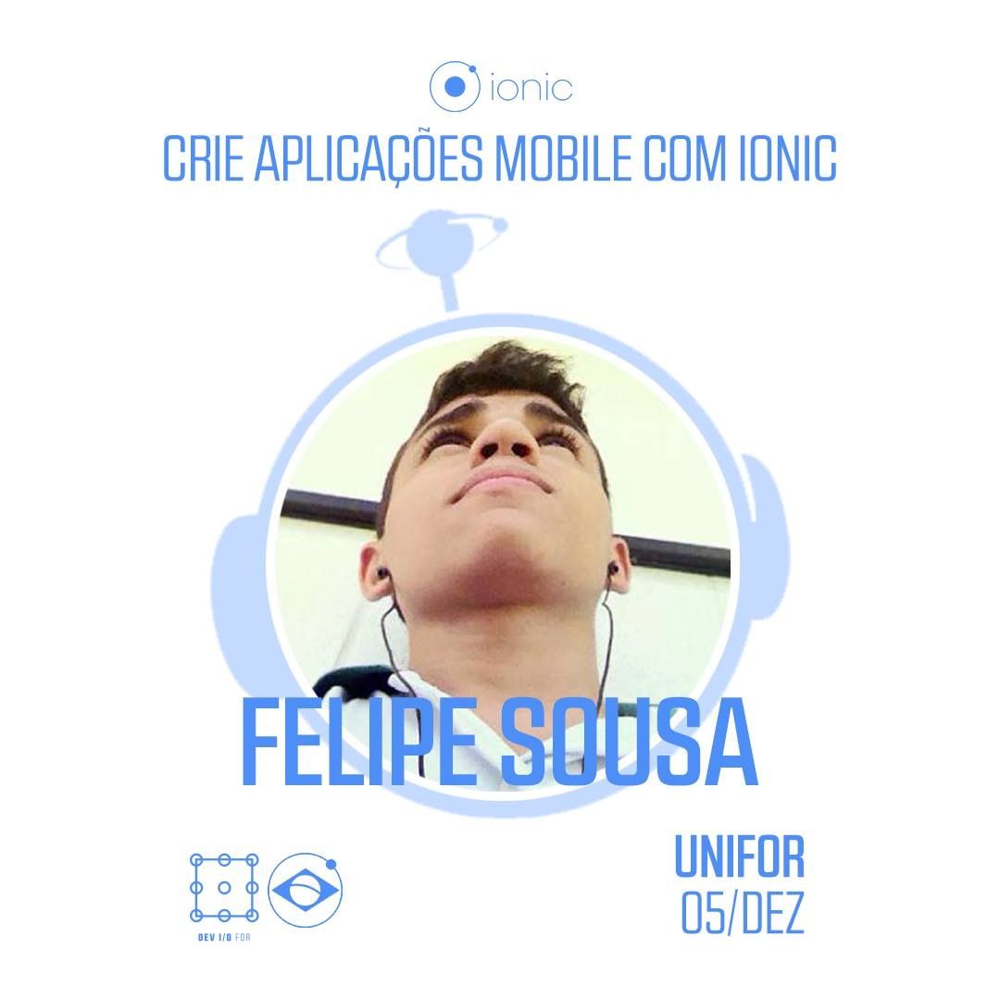

### Resumo

A Segunda edição do Ionic Meetup Fortaleza foi mais um encontro realizado pela comunidade local de Fortaleza no final de 2015. No encontro discutimos assuntos bem interessantes, como alguns temas bem novos pra época, como push-notifications e e um overview sobre o Ionic 2 que estava em pre-release no período.

 

# A Palestra

Submeti uma mini-talk sobre a importância de prototipar projetos antes de começar e comentando um pouco sobre o [Ionic Creator](https://creator.ionic.io/) com o título: "O que vem antes do getting starter?". O conceito principal foi apresentar formas de validações visuais para uma melhor validação e planejamento de desenvolvimento, antes mesmo de começar a escrever código. [Os slides possuem mais detalhes e você pode conferir aqui.](https://felipesousa.github.io/talks/IonicMeetup/#/)
